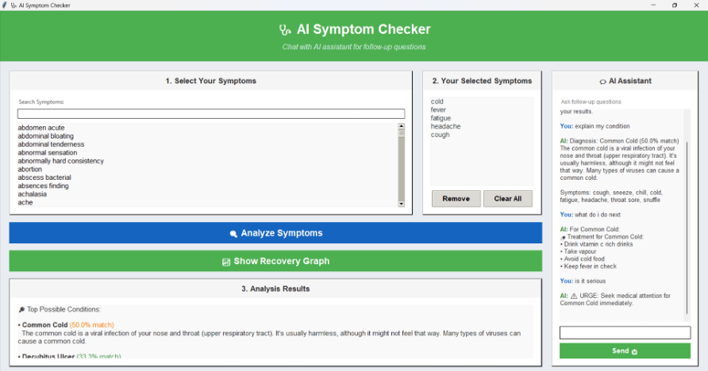

# 🩺 AI Symptom Checker

A robust desktop application for symptom-based disease diagnosis and medical advice, built with **Python** and **Tkinter**.

## ✨ Features
*   **Smart Diagnosis**: Select symptoms to receive ranked conditions based on probability algorithms (Jaccard + Coverage).
*   **AI Chatbot**: Integrated assistant to answer medical questions, identifying symptoms directly from chat.
*   **Visual Enhancements**: Clean UI with recovery graphs and severity estimation.

## sample


## 🚀 Quick Start 

in terminal run:

1.  **Install Dependencies**
    ```bash
    pip install matplotlib pandas #pip3 for some systems
    ```

2.  **Run the App**
    ```bash
    python apps.py #python3 for some systems
    ```

## ⚠️ Disclaimer
**For educational purposes only.** Not a substitute for professional medical advice.


[def]: image.png